<!DOCTYPE html>
<html lang="en">
<head>
<meta charset="UTF-8">
<meta name="viewport" content="width=device-width, initial-scale=1.0">
<title>Geni AI Global Hub - Official</title>

</head>

<body>

<nav>
<a href="index.html" class="logo">Geni AI</a>

<a href="index.html">Home</a>
<a href="pages/features.html">Features</a>
<a href="pages/wallet.html">Wallet</a>

<button class="dropbtn">Account ▾</button>

<a href="pages/account-safety.html">Account & Safety</a>
<a href="pages/privacy-policy.html">Privacy Policy</a>
<a href="pages/terms.html">Terms</a>
<a href="pages/delete-account.html">Delete Account</a>

<a href="pages/support.html">Support</a>

</nav>

<header>
<h1>Geni AI Global Hub</h1>

Official Mobile App Features & Screens Gallery

<a class="btn primary" href="#gallery">Explore Gallery</a>
<a class="btn" href="pages/features.html">View Features</a>
</header>

<h2>Explore Geni AI</h2>

Discover the main features, wallet, account safety and support.

<h3>🤖 AI Features</h3>

Explore image, video, voice and other AI creative tools.

<a class="btn" href="pages/features.html">Explore</a>

<h3>💰 Wallet & Store</h3>

Learn about rewards, credits, purchases and referrals.

<a class="btn" href="pages/wallet.html">View Wallet</a>

<h3>🛡️ Account & Safety</h3>

Account security and important account controls.

<a class="btn" href="pages/account-safety.html">View</a>

<h3>💬 Support</h3>

Get help through the official Geni AI support channels.

<a class="btn" href="pages/support.html">Support</a>

<h2>Policies & Account</h2>

Important privacy, legal and account-management information.

<h3>Privacy Policy</h3>

Read the complete Geni AI Privacy Policy.

<a class="btn" href="pages/privacy-policy.html">Read Policy</a>

<h3>Terms of Service</h3>

Read the complete terms for using Geni AI.

<a class="btn" href="pages/terms.html">Read Terms</a>

<h3>Delete Account</h3>

Permanently delete your Geni AI account.

<a class="btn" href="pages/delete-account.html">Delete Account</a>

<h2>Official App Gallery</h2>

Explore screenshots from different areas of Geni AI.

<button class="filter-btn active" onclick="filterGallery('all',this)">📂 All Folders</button>
<button class="filter-btn" onclick="filterGallery('ai',this)">🤖 AI Studio</button>
<button class="filter-btn" onclick="filterGallery('wallet',this)">💰 Wallet & Store</button>
<button class="filter-btn" onclick="filterGallery('tools',this)">🛠️ Tools & History</button>
<button class="filter-btn" onclick="filterGallery('profile',this)">👤 Profile & Safety</button>

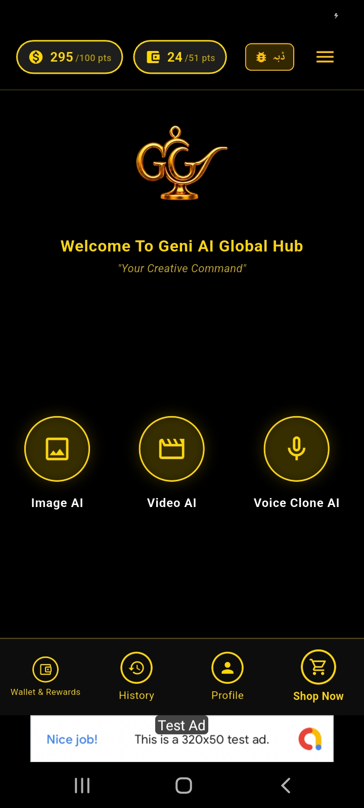

<h3>Main Dashboard</h3>
Central screen showing AI features and live coin balances simultaneously.

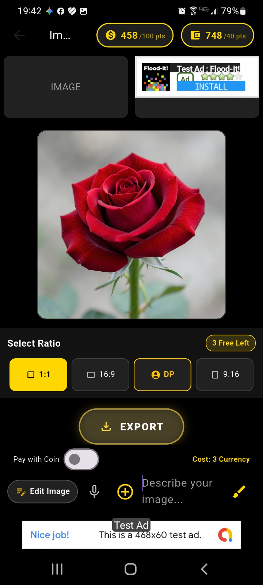

<h3>AI Image Generation</h3>
Powerful studio module designed for generating stunning and creative images.

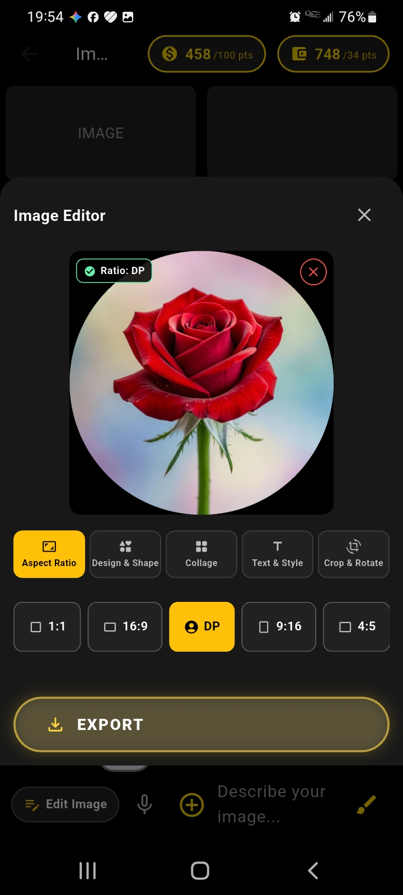

<h3>Image Editor & DP</h3>
Interface for editing, resizing, and tailoring pictures for profile displays.

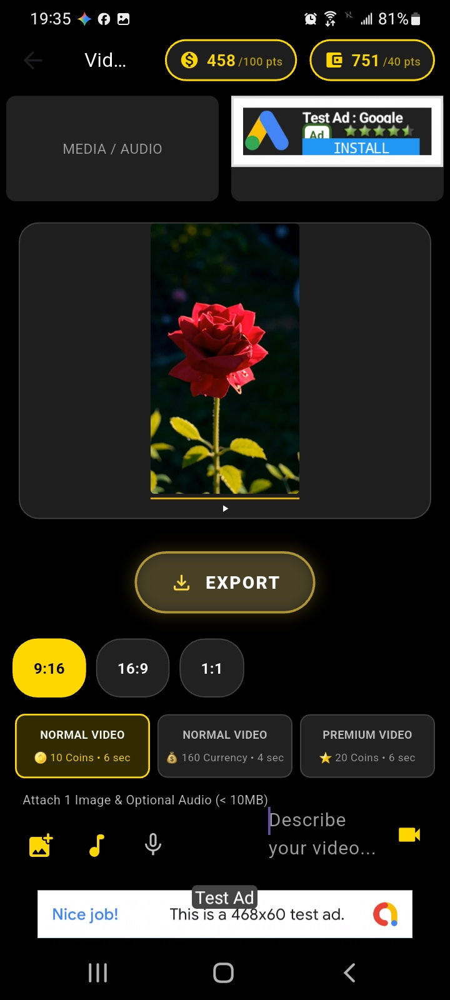

<h3>Video AI Studio</h3>
Advanced module to generate and manage AI videos seamlessly.

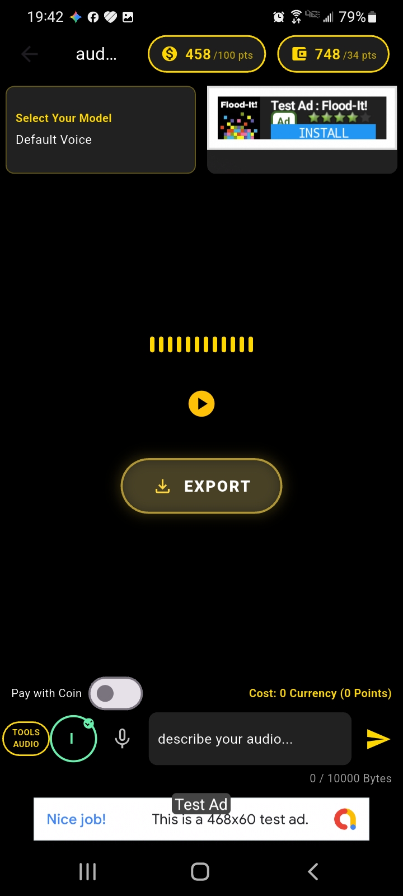

<h3>Voice AI Module</h3>
Interface for voice cloning, synthesis, and audio processing.

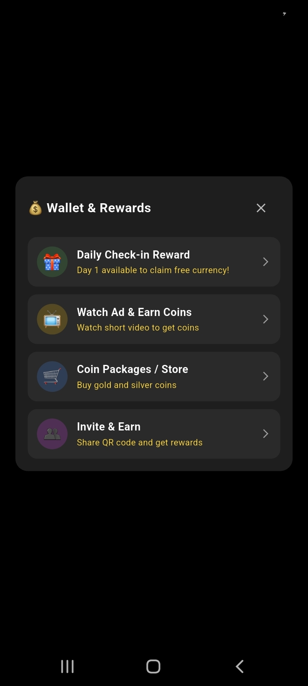

<h3>Wallet & Rewards Menu</h3>
Hub managing coin balance, daily rewards, and referrals.

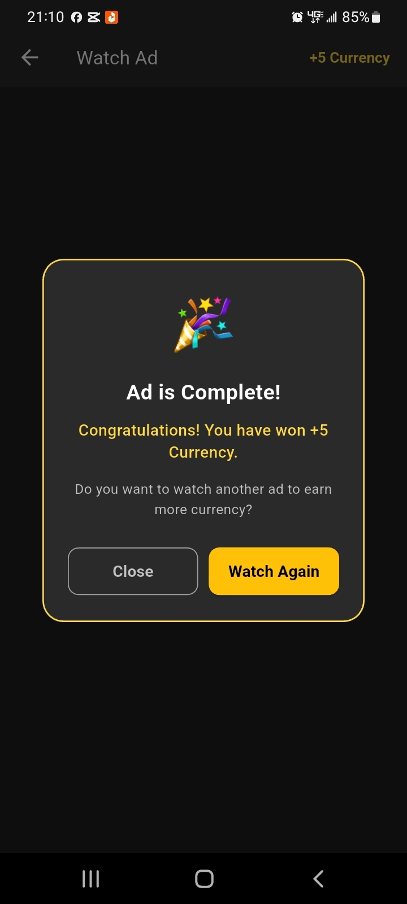

<h3>Ad Reward System</h3>
Earn free currency by watching rewarded video advertisements.

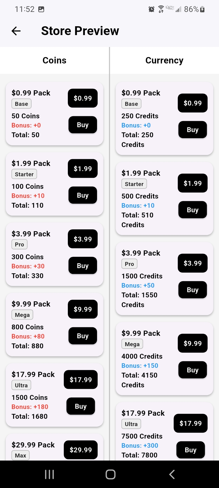

<h3>Credit Store (Package 1)</h3>
Store interface for available credit packages.

<h3>Credit Store (Package 2)</h3>
Detailed listing of additional credit offers and bundles.

<h3>Referral Invite System</h3>
Invite friends through QR code sharing and referral rewards.

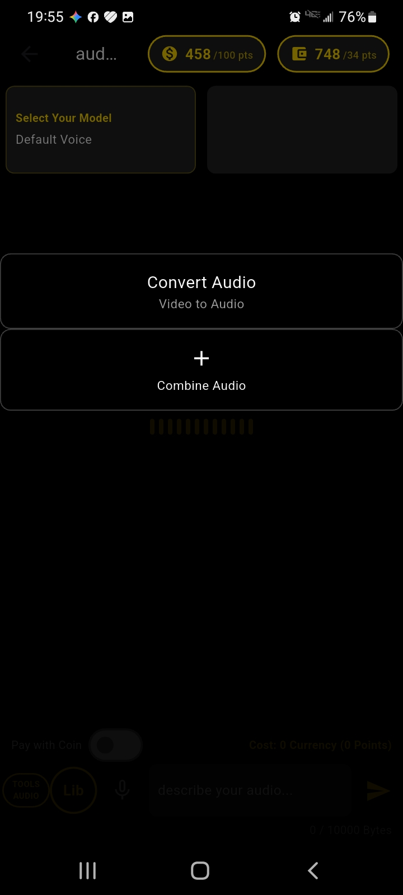

<h3>Audio Tools</h3>
Utilities supporting microphone recording and audio playback.

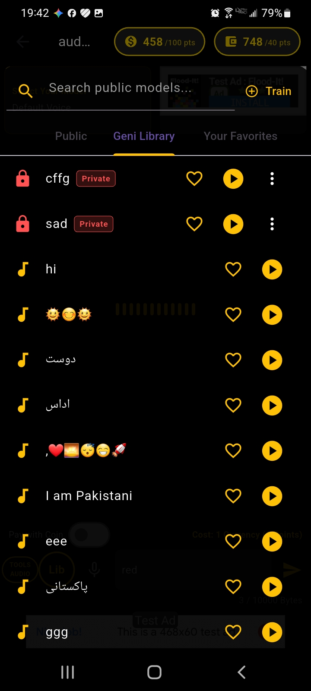

<h3>Voice Library</h3>
Repository for saved voice clips, audio samples, and outputs.

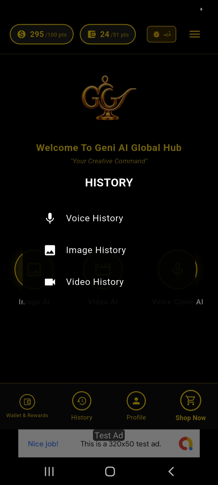

<h3>General History</h3>
Activity log tracking previous user sessions and events.

<h3>Image History</h3>
Gallery archiving previously generated images and artwork.

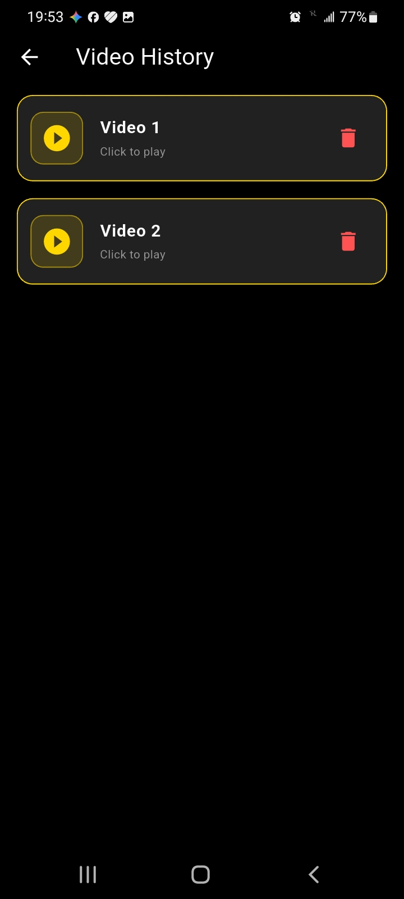

<h3>Video History</h3>
Record log of previously created AI videos.

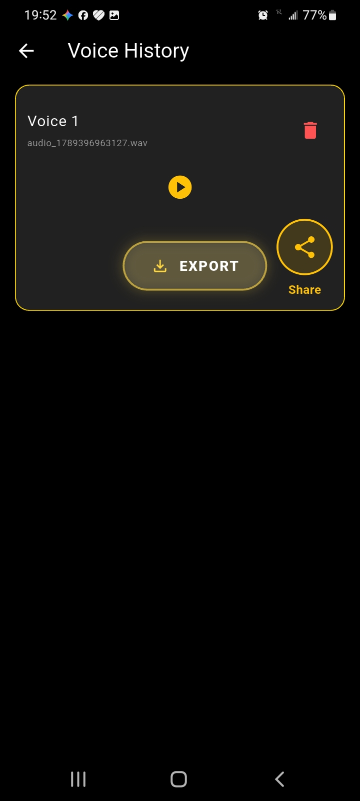

<h3>Voice History</h3>
Logs of previous voice generations and tasks.

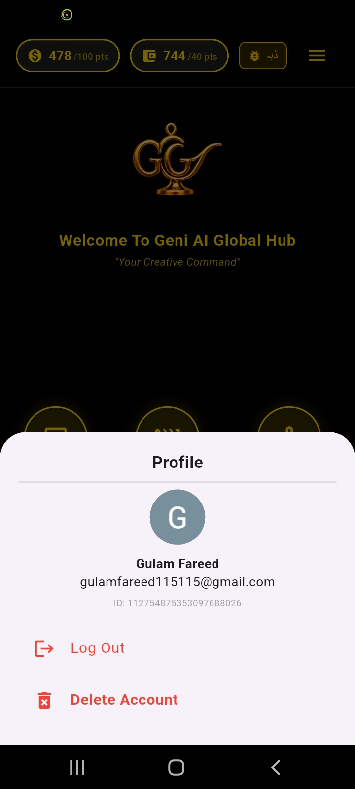

<h3>User Profile</h3>
Account settings and personal preference controls.

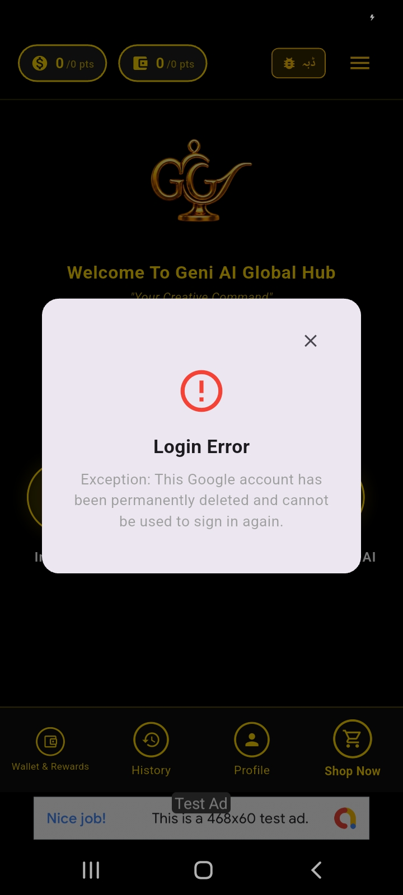

<h3>Account Safety</h3>
Security guidelines and account protection information.

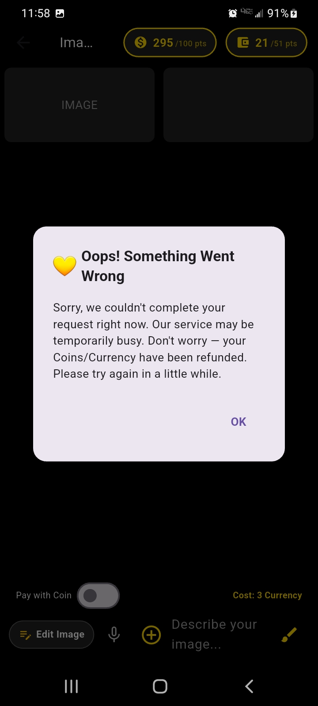

<h3>System Alert / Notice</h3>
Guidance for network connection or server errors.

<footer>

<a href="index.html">Home</a>
<a href="pages/features.html">Features</a>
<a href="pages/wallet.html">Wallet</a>
<a href="pages/account-safety.html">Account & Safety</a>
<a href="pages/privacy-policy.html">Privacy</a>
<a href="pages/terms.html">Terms</a>
<a href="pages/delete-account.html">Delete Account</a>
<a href="pages/support.html">Support</a>
<a class="whatsapp" href="https://whatsapp.com/channel/0029Vb8SKApE50UoFQ3PCT0d" target="_blank" rel="noopener">WhatsApp Channel</a>

&copy; 2026 Geni AI Global Hub. All rights reserved.

</footer>

</body>
</html>